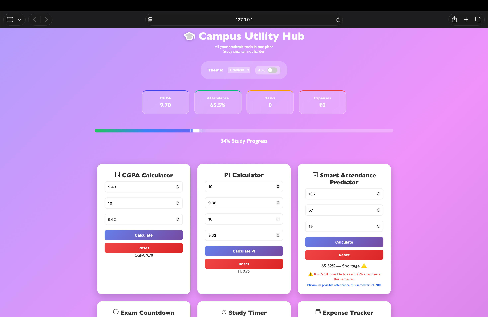
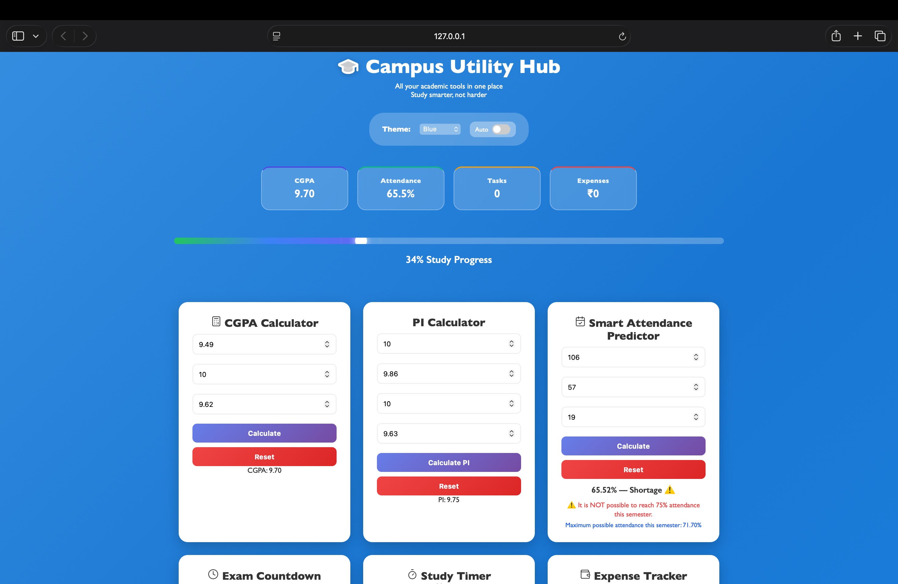
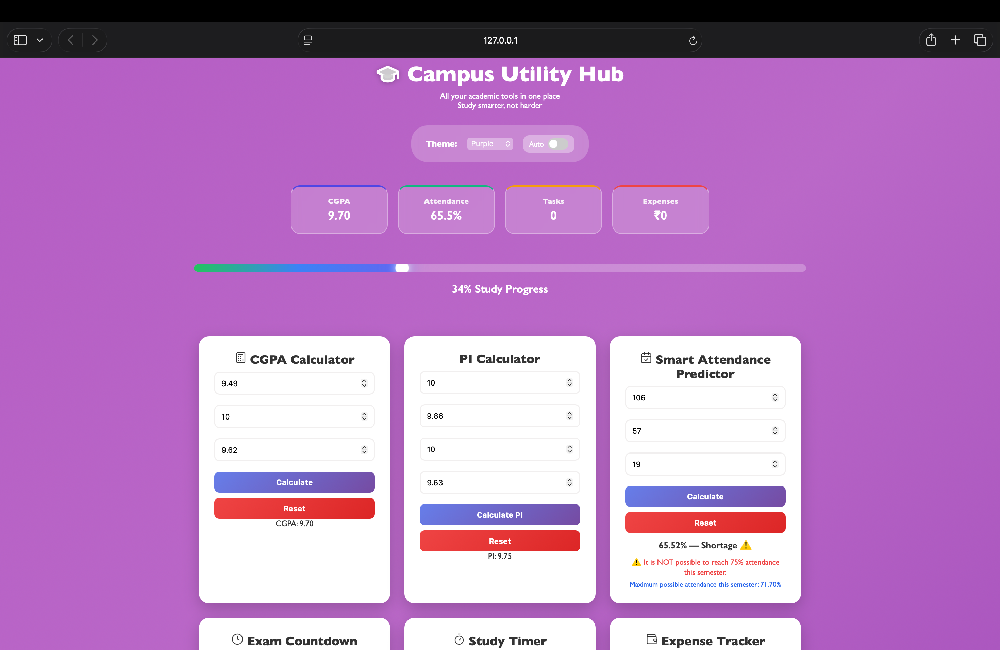
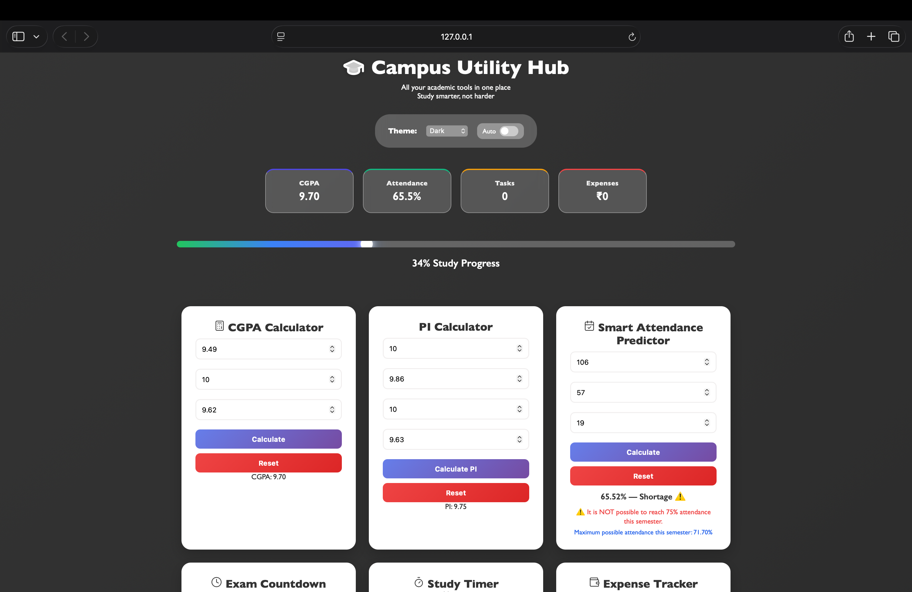
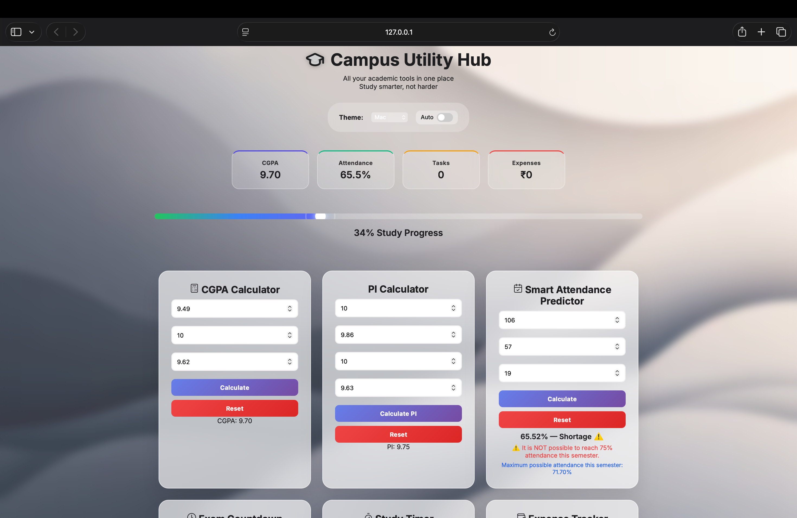
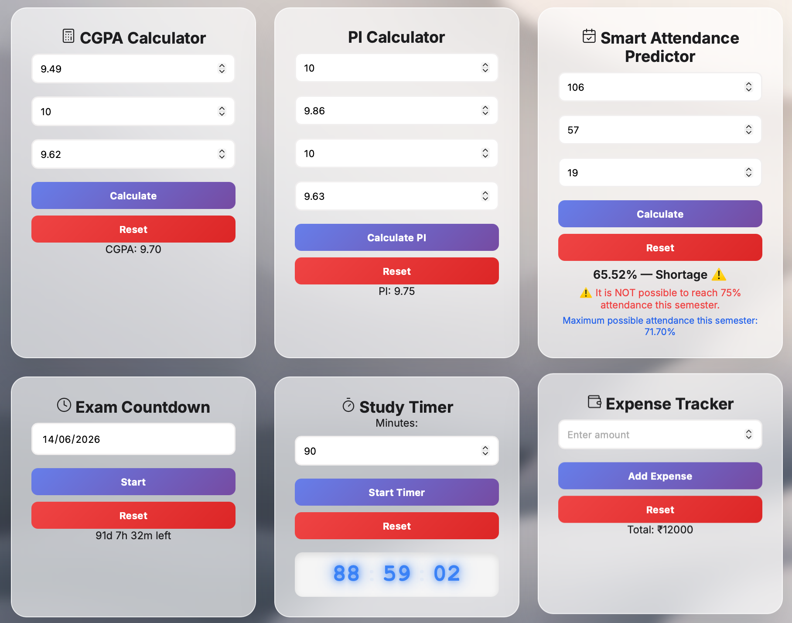
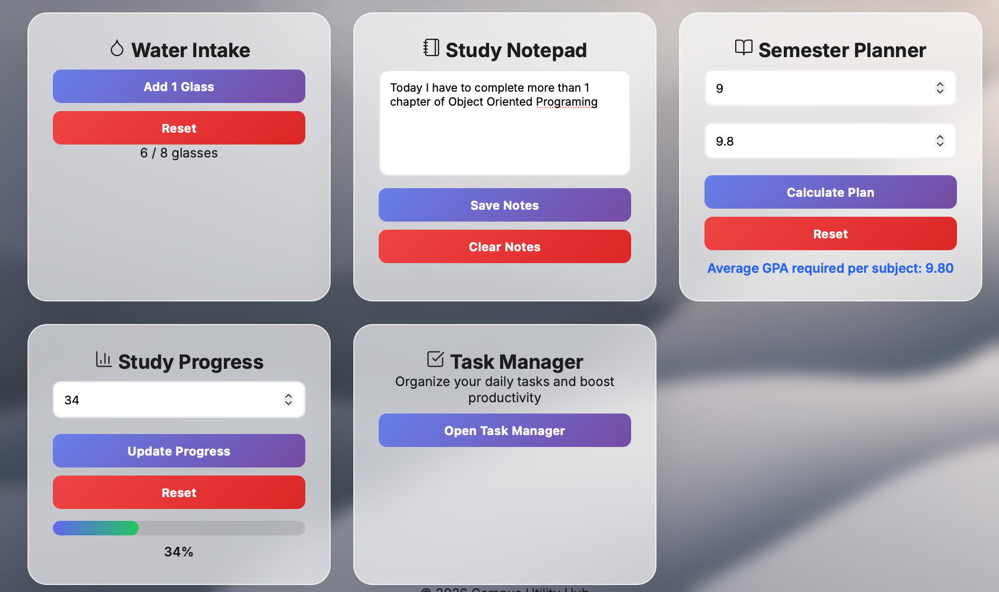

# 🎓 Campus Utility Hub
A web-based platform that provides essential student tools for quick calculations, tracking, and productivity.

A beginner-friendly open source student utility website developed under **ISTE HIT-SC Open Source 101**.

It brings essential academic and productivity tools together in one simple, browser-based platform.

---
## 🚀 Live Demo

👉 **https://aditya-ai00.github.io/campus-utility-hub/**

---

## 🚀 Features

📘 **CGPA Calculator**
Calculate your CGPA instantly by entering GPA values for different subjects. Provides quick results without page reload.

🧮 **PI Calculator**
Calculate Performance Index (PI) using subject credits and GPA values for accurate academic performance tracking.

📊 **Smart Attendance Predictor**
Predict attendance percentage and check whether reaching the 75% attendance requirement is still possible based on remaining classes.

⏳ **Exam Countdown Timer**
Set your exam date and view a live countdown showing the remaining time until the exam.

⏱ **Digital Study Timer**
A Pomodoro-style study timer with a digital display showing minutes, seconds, and milliseconds for focused study sessions.

💰 **Expense Tracker**
Track daily spending by adding expenses and automatically calculating the total amount spent.

💧 **Water Intake Tracker**
Monitor your daily hydration by tracking the number of glasses of water consumed.

📝 **Study Notepad**
Write and save quick study notes directly in the dashboard using browser local storage.

📅 **Semester Planner**
Plan your semester by calculating the required GPA per subject to achieve your target CGPA.

📈 **Study Progress Tracker**
Track study progress with an animated progress bar and dashboard progress summary.

📋 **Task Manager**
Manage daily tasks efficiently with the ability to add, complete, and track tasks.

🎨 **Multiple Theme Support**
Switch between Gradient, Blue, Purple, Dark, and Mac-style themes for a personalized UI experience.

⚡ **Real-Time Calculations**
All tools perform instant calculations without refreshing the page.

📱 **Responsive Design**
Fully responsive layout that works smoothly on desktop, tablet, and mobile devices.

---

## 📸 Project Preview

### 🎨 Dashboard Themes

#### 🌈 Gradient Theme

#### 🔵 Blue Theme

#### 🟣 Purple Theme

#### 🌙 Dark Theme

#### 🍎 Mac Theme

---

### 🧰 Dashboard Tools & Features

---

## 🛠️ Built With

- **HTML5** – Structure
- **CSS3** – Styling and layout
- **JavaScript (Vanilla)** – Logic and interactivity
- **GitHub Pages** – Hosting and deployment

No frameworks. No backend. Fully browser-based.

---

## 🎯 Purpose of the Project

This project was created to:

- Introduce students to open source contribution
- Teach frontend fundamentals
- Practice GitHub workflows
- Encourage collaboration
- Provide a real-world beginner project

The codebase is intentionally simple so **first-time contributors can participate confidently**.

---

## ▶️ Run Locally

### 1. Clone the repository

git clone https://github.com/aditya-ai00/campus-utility-hub.git

### 2. Open the project

cd campus-utility-hub

### 3. Run

Open index.html directly in your browser
or use Live Server in VS Code.

## 🤝 Contributing

Contributions are welcome from everyone.

### How to Contribute

Fork the repository

Clone your fork

git clone https://github.com/your-username/campus-utility-hub.git

Create a new branch

git checkout -b feature/your-feature-name

Make your changes

Commit clearly

git commit -m "feat: add dark mode toggle"

Push the branch

git push origin feature/your-feature-name

## 📌 Contribution Guidelines

Keep code clean and readable

One feature per pull request

Do not push directly to main

Test before submitting

Follow existing file structure

## 👨‍💻 Author

Aditya

GitHub: https://github.com/aditya-ai00  
LinkedIn: https://www.linkedin.com/in/aditya-kumar23/

## ⭐ Support the Project

If you find this project helpful:

### ⭐ Star the repository

### 🍴 Fork it

### 🧑‍💻 Contribute something small

Every contribution helps beginners learn.

## 📬 Contact

Have suggestions or issues?

Open an issue on GitHub

Reach out via repository discussions
## 🐞 Issues

If you find a bug or want to suggest a feature:

👉 https://github.com/aditya-ai00/campus-utility-hub/issues

## Built with ❤️ for ISTE HIT-SC Open Source 101

Learn • Build • Contribute
